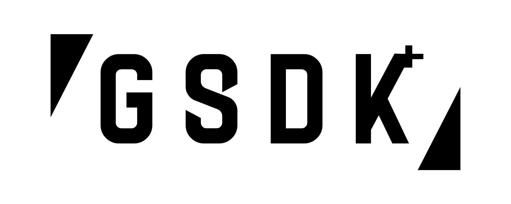

<h1 align="center">VSDK is now being rebranded to GSDK due to transfer of project from studio profile to main developer profile.</h1>

<p align="center"></p>

<h3 align="center">GSDK Development Phase: <code>GSDK_V0.0.0.7-ALPHA/DEV_PUBLISH</code>.</h3>
<h3 align="center">GSDK is currently being developed by a solo developer. I appreciate your patience and understanding as progress may take some time.</h3>


New! Visit documentation (extremely unfinished): https://violent-studio.github.io/vsdk

<h3 align="center">Example 1</h3>

```java
import com.raylib.Raylib;

import com.raylib.Jaylib.Vector3;

import static com.raylib.Jaylib.BLACK;

import vsdk.source.utils.WindowUtilities;
import static vsdk.source.utils.WindowUtilities.WindowFlags;

import vsdk.source.vectors.Vector2Df;
import vsdk.source.vectors.Vector3Df;

import vsdk.source.vrender.Quad;

import vsdk.source.utils.GShader;

public class Main {
    public static void main(String[] args) {
        WindowFlags flags = WindowUtilities.initWindow(
            "Window.",
            1000,
            800,
            120,
            WindowUtilities.FULLSCREEN_MODE,
            Raylib.FLAG_VSYNC_HINT | Raylib.FLAG_MSAA_4X_HINT,
            false
        );

        Raylib.Camera3D cam = new Raylib.Camera3D()
                ._position(new Vector3(1.0f, 0.0f, 0.0f))
                .target(new Vector3(0.0f, 0.0f, 0.0f))
                .up(new Vector3(0.0f, 1.0f, 0.0f))
                .fovy(45.0f)
                .projection(Raylib.CAMERA_PERSPECTIVE);

        GShader rainbow = new GShader(null, "shdr.frag", GShader.FILE, false);

        rainbow.combineFragment(GShader.FILE, "shdr2.frag");

        Raylib.DisableCursor();

        while(!Raylib.WindowShouldClose()) {
            Raylib.UpdateCamera(cam, Raylib.CAMERA_FREE);

            Raylib.BeginDrawing();
            Raylib.ClearBackground(BLACK);
            Raylib.BeginMode3D(cam);

            rainbow.setUniformFloat("time", (float) Raylib.GetTime());

            rainbow.begin();

            for(int z=-10; z < 20; z += 10) {
                Quad.drawQuad(
                    new Vector2Df(10, 10),
                    new Vector3Df(0, 0, z),
                    new Vector3Df(90, (float) Math.cos(Raylib.GetTime() * 0.7) * 90, 0),
                    BLACK,
                    true
                );
            }

            rainbow.end();

            Raylib.EndMode3D();
            Raylib.EndDrawing();
        }

        rainbow.unload();

        Raylib.CloseWindow();
    }
}
```

shdr.frag
```glsl
//:put-version

//:put-io
//:put-uni

void main() {
    //:pshdr#grad

    finalColor = color;
}
```

shdr2.frag
```glsl
//:version
#version 330

//:io
in vec2 fragTexCoord;
out vec4 finalColor;
//:eio

//:uni
uniform float time;
//:euni

void main() {
    //:shdr#grad
    float speed = 4.0;
    float frequency = 64.0;

    float red = 0.5 + 0.5 * sin(frequency * fragTexCoord.x + speed * time + 0.0);
    float green = 0.5 + 0.5 * sin(frequency * fragTexCoord.x + speed * time + 2.0);
    float blue = 0.5 + 0.5 * sin(frequency * fragTexCoord.x + speed * time + 4.0);

    vec4 color = vec4(red, green, blue, 1.0);
    //:eshdr

    finalColor = color;
}
```

<p align="center"></p>

<h3 align="center">GSDK Baked 2D Glow Textures.</h3>
<p align="center"></p>

<h3 align="center">GSDK Bump Mapping (Youtube).</h3>
<p align="center"><a href="https://www.youtube.com/watch?v=HUJ3RxE8DhQ"></a></p>
<h3 align="center"><a href="https://github.com/violent-studio/vsdk/blob/main/vsdk/examples%26docs/GLib.Ginet.TCP.md">GSDK Chat implementation via Ginet (Game Immediate mode Networking library).</a></h3>

<h3 align="center">GSDK Noise Generator.</h3>


<h3 align="center">GSDK Shader Playground.</h3>

<p align="center"></p>

<h3 align="center">GSDK IGUI.</h3>

<p align="center"></p>

<h3 align="center">GSDK OPC2D.</h3>

<p align="center"></p>

<h3 align="center">GSDK 3D Particle Emitter.</h3>

<p align="center"><br><i><sub>Smoke Tunnel</sub></i></p>
<p align="center"><br><i><sub>Smoke Torus</sub></i></p>
<p align="center"><br><i><sub>Particles</sub></i></p>
<p align="center"><br><i><sub>Smoke particles</sub></i></p>
