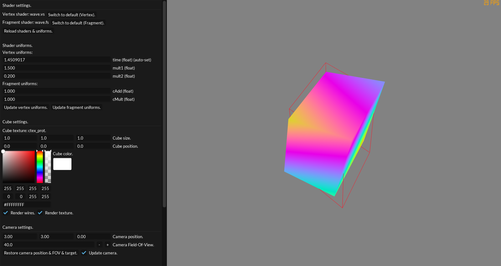

# GSDK Runnable Utility: Shader Playground V1.0.0


Simple shader playground with shader preview, hot reloading, uniform hot editing, camera settings, environment customizing, ETC.

GUI is extremely simple and intuitive, so I guess there is no documentation required.

Only few things that need to be noted:
- You can't change cube color when shader is applied (until you use `p_Color` in fragment shader).
- You can't see texture when shader is applied (until you implement this feature in your shader via `texture0`).
- You can set default values for uniforms in vertex/fragment shader:
```glsl
//p_DefVal=float:1.0
uniform float myUniform;

//p_DefVal=vec3:1.0,1.0,1.0
uniform vec3 myUniform2;
```
With comment starting with `p_DefVal=` you can set default uniform value. It's important to keep same syntax like in example. Spaces in vectors are *not supported*.
- Playground automatically specifies two uniforms: `vec4 p_Color` (`cMeshCol`) and `float time` (`Raylib.GetTime()`).
- Playground can't parse shader errors: Raylib does not provide any functionality for those operations; check console logs for information.
- Only `PNG` and `JPG` textures supported.

Playground TODO:
- Implement feature to change meshes.
- Cover `ivec2 p_Res` uniform.
